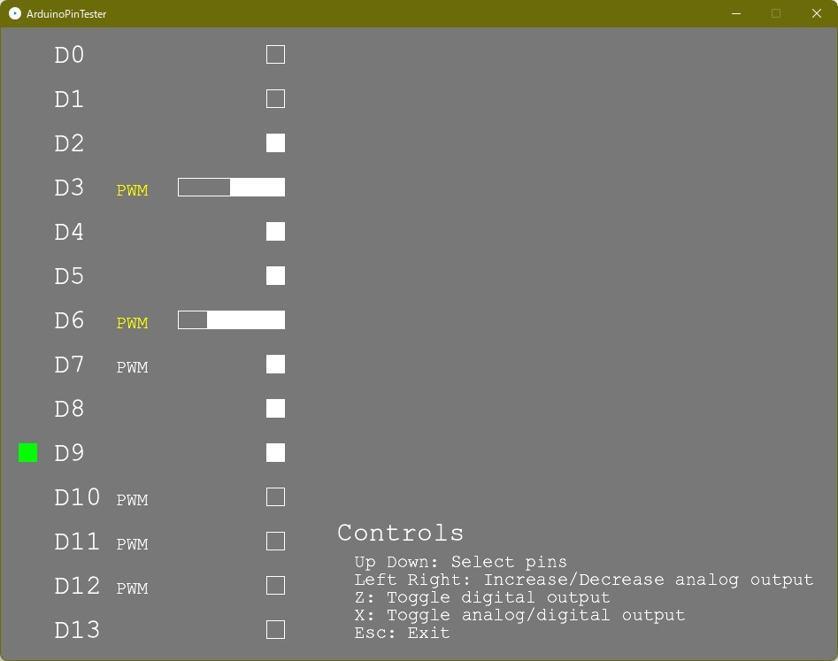

# ArduinoPinTester
K3004000「マイコン制御及び演習」で使用するArduinoのピンの出力をテストするプログラムです。課題4において使用する事を想定しています。

Arduinoの各デジタルピンの出力のオンオフを簡単に切り替える事が出来ます。PWMに対応しているピンは、アナログ出力も確認する事が出来ます。アナログ出力中は、該当するピンの「PWM」の表示が黄色くなります。

## 操作方法
| キー | 説明 |
| --- | --- |
| ↑/↓ | ピンの選択 |
| ←/→ | アナログ出力の増減 |
| Z | デジタル出力のオンオフ切り替え |
| X | アナログ/デジタル出力の切り替え |
| Esc | プログラムの終了 |